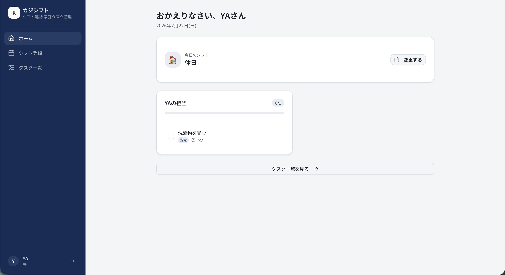
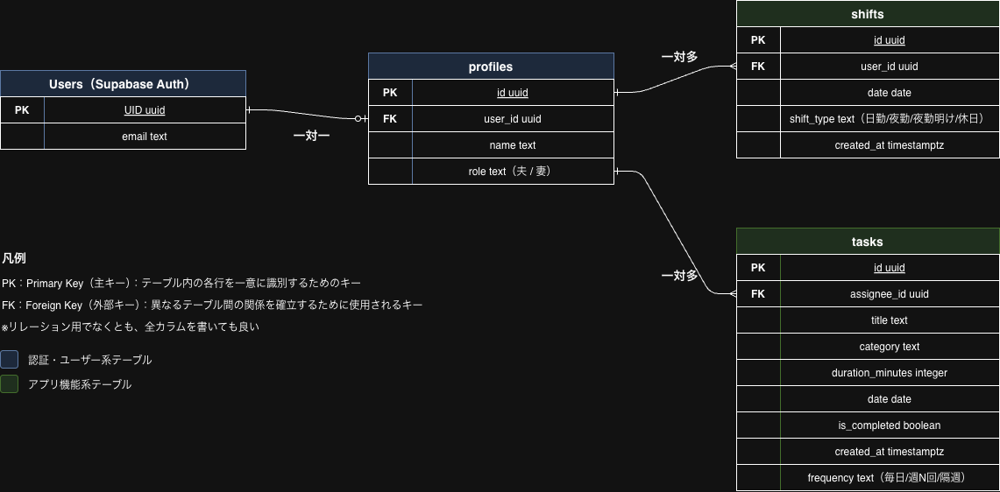

# KajiShift（カジシフト）

シフト連動型 家庭タスク管理アプリ

## アプリ概要

Next.jsとSupabaseを用いた、不規則シフト勤務者向けの家庭タスク管理アプリです。  
勤務パターン（日勤/夜勤/夜勤明け/休日）を登録するだけで、夫婦の家事タスクを管理できます。

**開発背景：** 自身が夜勤ありの施工管理職として働く中で、不規則な勤務により家事を妻に任せきりになってしまう課題がありました。既存のタスク管理アプリは「毎日同じルーティン」を前提としており、シフト勤務者の家庭には最適化されていません。そこで、勤務パターンに応じた家事管理ができるアプリを開発しました。

## サイトイメージ

<!-- アプリ完成後、メインページのスクリーンショットをdocs/に格納し、以下のコメントアウトを解除してください -->
<!--  -->

## サイトURL

<!-- デプロイ後、以下にVercelのURLを貼ってください -->
<!-- https://kaji-shift.vercel.app/ -->

（デプロイ後に追記予定）

## 使用技術

- フロントエンド：Next.js（React）
- バックエンド：Next.js API Routes
- データベース：PostgreSQL（Supabase）
- 認証：Supabase Auth
- デプロイ：Vercel
- バージョン管理：Git、GitHub
- 開発環境：VS Code
- デザイン・プロトタイプ：v0

## 設計ドキュメント

[要件定義・基本設計・詳細設計の一覧（Googleスプレッドシート）](ここにGoogleスプレッドシートの共有URLを貼る)

詳細設計時のワイヤーフレーム、ER図、ワークフロー図の画像はdocsディレクトリに格納しています。（[こちらからアクセス](docs/)）

### ER図

### ワイヤーフレーム

- [ワイヤーフレーム](docs/wireframe.png)

### ワークフロー図

- [サインアップ](docs/workflow-signup.png)
- [シフト登録（UPSERT）](docs/workflow-shift-upsert.png)
- [タスク完了切替](docs/workflow-task-toggle.png)
- [ダッシュボード表示](docs/workflow-dashboard.png)

## 機能一覧

- ユーザー登録・ログイン・ログアウト（Supabase Auth）
- 勤務パターン登録（日勤/夜勤/夜勤明け/休日）
- 家事タスクのCRUD（作成・閲覧・更新・削除）
- タスク完了チェック（楽観的更新）
- ダッシュボード（今日のシフト＋担当タスク一覧表示）
- ログインユーザーごとの表示分岐（Next.js Middleware）

### 今後の実装予定

- シフトに応じた自動タスク割り振りロジック
- 家族グループの作成・招待機能
- 週次の分担比率グラフ表示
- RLS（行レベルセキュリティ）による家族間のデータ分離

## テスト・修正の設計及び実施書

<!-- テスト実施後、以下にGoogleスプレッドシートの共有URLを貼ってください -->
（テスト実施後に追記予定）

## アプリの改善案

<!-- 改善案作成後、以下にGoogleスプレッドシートの共有URLを貼ってください -->
（改善案作成後に追記予定）

## 備考

- 活用した生成AIとその用途
  - ChatGPT / Claude：要件定義、設計、各種リサーチ
  - v0：アプリのモック作成、フロントエンド実装
- リファクタリングの規則
  - 2つ以上のファイルで使う、行数が10以上のUIコンポーネントはcomponentsフォルダに移行
  - 2つ以上のファイルで使う、行数が10以上の関数はlibフォルダに移行
  - 変数名で2つ以上の単語が入る場合は、キャメルケース（例：isCompleted）を使用
